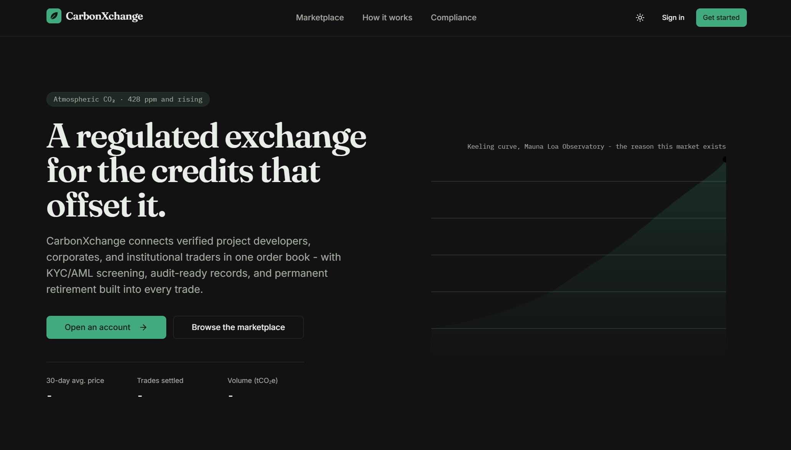

# CarbonXchange


## Blockchain-Based Carbon Credit Trading Platform

CarbonXchange is a carbon credit trading platform: a Flask backend that registers and verifies offset projects, issues, transfers, and retires credits on-chain, and runs a marketplace, paired with a React web dashboard and a React Native (Expo) mobile app. A small scikit-learn forecasting library sits alongside the application as a standalone, untied research module.

<div align="center">
  
</div>

## Table of Contents

- [Overview](#overview)
- [Project Structure](#project-structure)
- [Feature Status](#feature-status)
- [Technology Stack](#technology-stack)
- [Architecture](#architecture)
- [Installation and Setup](#installation-and-setup)
- [Running the Stack](#running-the-stack)
- [API Surface](#api-surface)
- [Testing](#testing)
- [CI/CD Pipeline](#cicd-pipeline)
- [Documentation](#documentation)
- [Contributing](#contributing)
- [License](#license)

## Overview

CarbonXchange demonstrates a carbon credit workflow across a real, runnable codebase. The application tier (backend, smart contracts, and two clients) is wired and covered by tests, with the backend genuinely reading and writing to the deployed contracts through web3.py rather than simulating on-chain state. A small scikit-learn forecasting library sits alongside it but is not called by any live endpoint.

## Project Structure

```
CarbonXchange/
├── code/
│   ├── backend/               # Flask service: API, auth, services, DB
│   │   ├── src/routes/        # auth, user, carbon_credits, trading, market,
│   │   │                      # compliance, admin blueprints
│   │   ├── src/services/      # blockchain_service (web3.py), auth, trading
│   │   ├── src/models/        # SQLAlchemy models
│   │   └── tests/             # Backend test suite (pytest)
│   ├── blockchain/            # Truffle project
│   │   ├── contracts/         # CarbonCreditToken, AdvancedCarbonCreditToken,
│   │   │                      # Marketplace, AdvancedMarketplace
│   │   └── tests/             # Truffle/Mocha test suite (runs against Ganache)
│   └── ai_models/
│       └── training_scripts/  # scikit-learn forecasting models (standalone)
├── web-frontend/               # React (Vite) dashboard
├── mobile-frontend/            # React Native + Expo app
├── infrastructure/             # Docker, Kubernetes, Terraform, Ansible
├── scripts/                    # Setup, orchestration, test, and deploy scripts
├── docs/                       # Documentation (this directory)
└── README.md
```

## Feature Status

### Application tier (wired and tested)

| Component                | Details                                                                                                                                                                                                                                                         |
| :----------------------- | :-------------------------------------------------------------------------------------------------------------------------------------------------------------------------------------------------------------------------------------------------------------- |
| **API**                  | Flask backend exposing endpoints under `/api/*` for auth, users, carbon credits, trading, market data, compliance, and admin.                                                                                                                                   |
| **Auth**                 | Password hashing, JWT access and refresh tokens (Flask-JWT-Extended), and TOTP-based MFA (pyotp). `SECRET_KEY` and `JWT_SECRET_KEY` default to a random per-process value if unset, and startup validation rejects the shipped placeholder value in production. |
| **On-chain integration** | A real web3.py service that signs and sends transactions to register and verify offset projects, issue, transfer, and retire credits, and place marketplace orders, then reads back the resulting event logs.                                                   |
| **Smart contracts**      | Truffle-managed Solidity contracts, tested against Ganache: an ERC20 carbon credit token (plus an "advanced" pausable variant) and marketplace contracts for listing and trading credits.                                                                       |
| **Data layer**           | SQLAlchemy over PostgreSQL, with Redis for caching and rate limiting, and Alembic managing migrations.                                                                                                                                                          |
| **Web dashboard**        | React and TypeScript app (Vite, Tailwind, shadcn/ui on Radix primitives) covering Home, Dashboard, Marketplace, Trade, Portfolio, Orders, Transactions, Project Detail, Compliance, Admin, Profile, and authentication screens.                                 |
| **Mobile app**           | React Native (Expo) app covering the same functional areas through React Navigation's bottom-tab and stack navigators, with Redux Toolkit for state. The web dashboard does not use Redux; it relies on React Context instead.                                  |

### Research tier (library module)

| Component              | Details                                                                                                                                        |
| :--------------------- | :--------------------------------------------------------------------------------------------------------------------------------------------- |
| **Forecasting models** | scikit-learn regressors (Random Forest, Elastic Net, SVR, and an MLP) for price and credit-volume forecasting, trained via standalone scripts. |

This module is not imported anywhere in the backend, so there is currently no live prediction endpoint at all.

## Technology Stack

| Area              | Technology                                                                                                     |
| :---------------- | :------------------------------------------------------------------------------------------------------------- |
| Blockchain        | Solidity, OpenZeppelin, Truffle, Ganache                                                                       |
| Backend API       | Python 3.11+, Flask, Flask-SQLAlchemy, Flask-JWT-Extended, Flask-Limiter                                       |
| Auth              | Werkzeug/passlib password hashing, PyJWT, pyotp (MFA)                                                          |
| Blockchain client | web3.py, eth-account                                                                                           |
| Data layer        | SQLAlchemy 2, Alembic, PostgreSQL, Redis                                                                       |
| ML / Quant        | scikit-learn (Random Forest, Elastic Net, SVR, MLP) for offline forecasting                                    |
| Web frontend      | React 18, TypeScript, Vite, Tailwind CSS, shadcn/ui (Radix primitives), Recharts, React Hook Form, Zod         |
| Mobile frontend   | React Native, Expo, React Navigation, Redux Toolkit                                                            |
| Infrastructure    | Docker, Docker Compose, Kubernetes, Terraform (modular AWS network/security/compute/database/storage), Ansible |
| CI/CD             | GitHub Actions                                                                                                 |
| Testing           | pytest (backend), Truffle/Mocha against Ganache (contracts), Vitest (web, configured but no test files yet)    |

## Architecture

```
Clients
  ├── web-frontend (React)               ── HTTP/JSON ──┐
  └── mobile-frontend (React Native)     ── HTTP/JSON ──┤
                                                        ▼
Backend (Flask)
  ├── Blueprints (/api/*)   auth, users, carbon-credits, trading,
  │                         market, compliance, admin
  ├── Services              blockchain (web3.py), auth, trading
  └── Data layer             PostgreSQL (SQLAlchemy + Alembic), Redis

Blockchain (Truffle / Solidity, tested against Ganache)
  CarbonCreditToken (ERC20) · AdvancedCarbonCreditToken · Marketplace · AdvancedMarketplace

Research library (code/ai_models/training_scripts)
  scikit-learn forecasting models, trained offline, not called by the live API
```

See [docs/architecture.md](docs/architecture.md) for detail.

## Installation and Setup

Prerequisites: Python 3.11+, Node.js 18+, and (for the blockchain tests) Ganache.

```bash
git clone https://github.com/quantsingularity/CarbonXchange.git
cd CarbonXchange

# Blockchain
cd code/blockchain
npm install

# Backend
cd ../backend
python -m venv .venv && source .venv/bin/activate
pip install -r requirements.txt

# Web frontend
cd ../../web-frontend
npm install

# Mobile frontend
cd ../mobile-frontend
npm install
```

For an automated setup:

```bash
git clone https://github.com/quantsingularity/CarbonXchange.git
cd CarbonXchange
./scripts/dev_env/cx_setup_env.sh
./scripts/orchestration/cx_run_dev.sh
```

Full, environment-specific instructions are in [docs/INSTALLATION.md](docs/INSTALLATION.md).

## Running the Stack

```bash
# 1) Supporting services (from infrastructure/, Docker required)
docker compose up -d database redis

# 2) Local chain (from code/blockchain)
npx ganache --host 127.0.0.1 --port 8545

# 3) Deploy contracts to the local chain (from code/blockchain)
npx truffle migrate --network development

# 4) Backend (from code/backend, venv active)
python src/main.py                 # serves http://0.0.0.0:5000

# 5) Web dashboard (from web-frontend)
npm run dev                        # http://localhost:5173 (Vite default)

# 6) Mobile app (from mobile-frontend)
npm start                          # press w for web, a for Android, i for iOS
```

See [docs/USAGE.md](docs/USAGE.md) and [docs/CONFIGURATION.md](docs/CONFIGURATION.md).

## API Surface

Base URL `http://localhost:5000`.

| Group          | Prefix                | Highlights                                                                   |
| :------------- | :-------------------- | :--------------------------------------------------------------------------- |
| Auth           | `/api/auth`           | `register`, `login`, `refresh`, `logout`, `me`, `verify-email`               |
| Users          | `/api/users`          | list/create, `{id}`, `me`, `me/profile`                                      |
| Carbon Credits | `/api/carbon-credits` | list/create, `{id}/retire`, `{id}/tokenize`, `projects`, `blockchain/status` |
| Trading        | `/api/trading`        | `orders`, `orders/{id}/cancel`, `trades`, `portfolio`, `portfolio/holdings`  |
| Market         | `/api/market`         | `data`, `ticker/{symbol}`, `prices`, `summary`, `depth/{symbol}`             |
| Compliance     | `/api/compliance`     | `records`, `reports`, `reports/{id}/submit`, `status`, `aml/summary`         |
| Admin          | `/api/admin`          | `users`, `users/{id}/status`, `users/{id}/unlock`, `system`                  |

Full request and response shapes are in [docs/API.md](docs/API.md).

## Testing

```bash
# Smart contracts (from code/blockchain, with Ganache running)
npx truffle test

# Backend (from code/backend)
pytest

# Web (from web-frontend)
npm test
```

The backend suite covers the blockchain service, trading service, and the carbon-credits, compliance, and market routes. The Truffle suite covers each contract individually against a real Ganache instance. The web frontend has Vitest configured but no test files yet, and the mobile app's `__tests__` directory currently holds only a placeholder README rather than any tests, so neither is exercised in CI today.

## CI/CD Pipeline

GitHub Actions (`.github/workflows/cicd.yml`) runs four jobs on push, pull request, and manual dispatch:

| Job                  | Depends on          | What it does                                                                          |
| :------------------- | :------------------ | :------------------------------------------------------------------------------------ |
| Code Quality Checks  | -                   | Python formatter checks (autoflake, black) and a repository-wide Prettier check       |
| Smart Contract Tests | Code Quality Checks | Compiles the contracts with Truffle, starts Ganache, and runs the contract test suite |
| Backend Tests        | Code Quality Checks | Runs the pytest suite with coverage and uploads the coverage report as an artifact    |
| Web-Frontend Build   | Code Quality Checks | Installs dependencies and produces the production web build (no test step)            |

There is currently no CI job for the mobile app.

## Documentation

| Document                                           | Contents                               |
| :------------------------------------------------- | :------------------------------------- |
| [docs/README.md](docs/README.md)                   | Documentation index                    |
| [docs/architecture.md](docs/architecture.md)       | System architecture                    |
| [docs/API.md](docs/API.md)                         | REST API reference                     |
| [docs/INSTALLATION.md](docs/INSTALLATION.md)       | Setup for all components               |
| [docs/CONFIGURATION.md](docs/CONFIGURATION.md)     | Environment variables and config       |
| [docs/USAGE.md](docs/USAGE.md)                     | Running and using the platform         |
| [docs/CLI.md](docs/CLI.md)                         | Helper scripts reference               |
| [docs/FEATURE_MATRIX.md](docs/FEATURE_MATRIX.md)   | Feature status, implemented vs planned |
| [docs/SMART_CONTRACTS.md](docs/SMART_CONTRACTS.md) | Contract architecture and interfaces   |
| [docs/troubleshooting.md](docs/troubleshooting.md) | Common issues and fixes                |
| [docs/contributing.md](docs/contributing.md)       | Contribution guide                     |
| [docs/examples/](docs/examples/)                   | Worked examples                        |

## Contributing

See [docs/contributing.md](docs/contributing.md).

## License

This project is licensed under the MIT License - see the [LICENSE](LICENSE) file for details.
